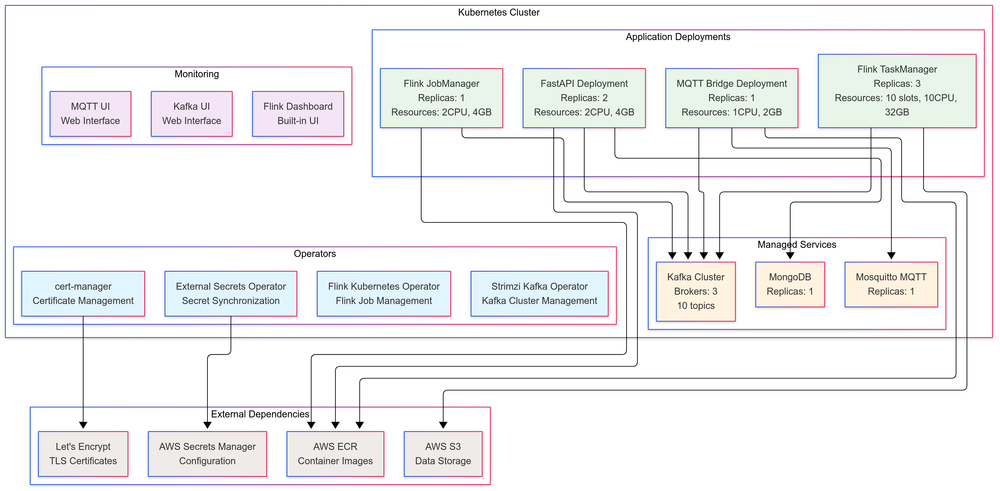
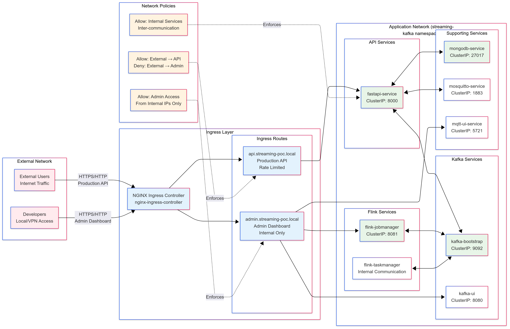
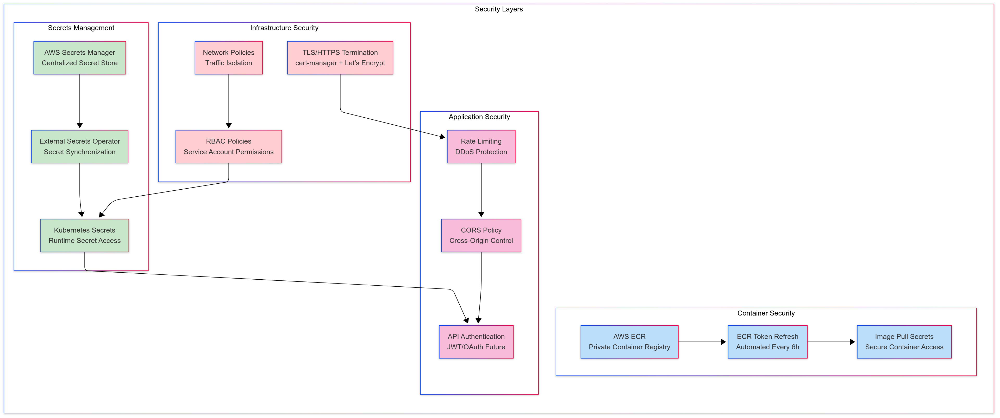
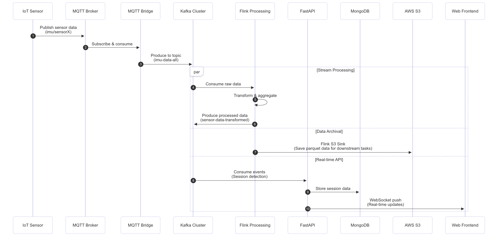

# 🚀 Real-time IoT Data Streaming Platform

**⚡ Proof of Work - Enterprise-Grade Streaming Architecture**

A production-ready, cloud-native streaming data processing platform for IoT sensors using modern event-driven architecture. Built with Apache Kafka, Apache Flink, FastAPI, and MQTT on Kubernetes with automated AWS integration.

> **📌 Notes:**  
> This repository demonstrates my expertise in **distributed systems**, **real-time data processing**, and **cloud-native architectures**. While functional as a complete streaming platform, certain proprietary components have been simplified or abstracted to protect intellectual property, as would be expected in enterprise environments.

---

## 📋 **Table of Contents**
- [🎯 Proof of Work Overview](#-proof-of-work-overview)
- [🏗️ System Architecture](#️-system-architecture)
- [✨ Key Features](#-key-features) 
- [🔧 Technology Stack](#-technology-stack)
- [📋 Prerequisites](#-prerequisites)
- [🚀 Quick Start](#-quick-start)
- [🌐 Production Access & HTTPS Setup](#-production-access--https-setup)
- [🔧 Configuration](#-configuration)
- [📊 Monitoring & Observability](#-monitoring--observability)
- [🛠️ Development](#️-development)
- [🔄 Operations](#-operations)
- [� API Documentation](#-api-documentation)
- [📝 Make Commands Reference](#-make-commands-reference)
- [🏆 Production Checklist](#-production-checklist)

---

## 🎯 **Proof of Work Overview**

### **👨‍💻 Skills Demonstrated in This Project**

This repository showcases my ability to architect, implement, and operate enterprise-grade streaming platforms. Here's what I've built and the expertise it demonstrates:

#### **🌐 Distributed Systems Engineering**
```
✅ Event-Driven Architecture     → Understanding of loose coupling & scalability
✅ Message Queuing (Kafka)       → Experience with high-throughput systems  
✅ Stream Processing (Flink)     → Real-time analytics & complex event processing
✅ Microservices Design         → Service decomposition & API design
✅ Database Integration         → Multi-modal data storage (MongoDB, S3)
```

#### **☁️ Cloud-Native & DevOps Expertise**  
```
✅ Kubernetes Orchestration     → Production container management
✅ Helm Charts & GitOps         → Infrastructure as Code
✅ GitOps with Flux CD          → Automated deployment pipelines (separate repo)
✅ AWS EKS Management           → Multi-environment cluster orchestration
✅ AWS Integration              → ECR, S3, Secrets Manager, IAM
✅ Ingress & Load Balancing     → Production traffic management  
✅ Monitoring & Observability   → Prometheus, Grafana, structured logging
```

#### **🔐 Enterprise Security & Reliability**
```
✅ TLS/HTTPS Configuration      → Security best practices
✅ Secrets Management           → External Secrets Operator integration
✅ Network Policies             → Zero-trust security model
✅ High Availability            → Multi-replica, fault-tolerant design
✅ Disaster Recovery            → Backup strategies & data persistence
```

#### **⚡ Performance & Scale Engineering**
```  
✅ High-Throughput Design       → 200+ sensors ofs fs=200Hz concurrent messaging capability with minimal resources  (including stateful ml model inference without gpu)
✅ Low-Latency Processing       → Sub-100ms end-to-end processing
✅ Resource Optimization        → Memory, CPU, and storage tuning
✅ Horizontal Scaling          → Auto-scaling based on load
✅ Performance Monitoring       → Metrics, alerting, and optimization
```

---

### **🔒 What's Intentionally Simplified/Hidden**

In enterprise environments, certain components contain proprietary algorithms or sensitive data. This demo includes **functional implementations** while protecting intellectual property:

#### **🧠 Core Flink Processing Logic**
```java
// Production Version (Hidden):
├── Proprietary ML inference algorithms
├── Advanced signal processing techniques  
├── Custom feature engineering pipelines
├── Optimized windowing strategies

// Demo Version (Simplified):
├── Basic feature transformations ✅
├── Standard statistical computations ✅  
├── Window based aggregations per sensor ✅
├── Onnx stateful ML model inference ✅
└── Business-specific session detection logic for aggregations ✅
```

#### **🔑 AWS Credentials & Configuration**
```bash
# Production Secrets (Not Included):
- Real AWS account credentials
- Production database connection strings
- API keys for external services
- Customer-specific configuration
- Performance tuning parameters

# Demo Configuration (Included):  
- Template configuration files ✅
- Local development setup ✅
- Mock data generation ✅
- Kubernetes deployment manifests ✅
- Development AWS integration examples ✅
```

#### **📊 Real Sensor Data & Models**
```
# Production Assets (Protected):
- Proprietary training datasets
- Trained machine learning models (PyTorch/TensorFlow)
- MLflow experiment tracking & model registry
- Model deployment pipelines & A/B testing frameworks
- Customer sensor data patterns & behavioral analytics
- Performance benchmarks & production metrics
- Business intelligence insights & KPI dashboards


# Demo Assets (Available):
- Synthetic sensor data generators ✅
- ONNX model inference ✅
- Sample data for testing ✅
- Architecture documentation ✅
- Performance testing frameworks ✅
```

#### **🚀 GitOps & Infrastructure Deployment**
```bash
# Production GitOps (Separate Repository):
- Flux CD EKS deployment manifests
- Environment-specific configurations (dev/staging/prod)
- ArgoCD application definitions
- Pulumi infrastructure as code
- AWS EKS cluster provisioning

# Demo Deployment (Included):
- Direct Helm deployment for quick setup ✅
- Local Minikube development environment ✅
- Basic Kubernetes manifests ✅
- Single-cluster deployment examples ✅
- Development-focused configuration ✅
```

> **🔧 Note on GitOps:** Production deployments use **Flux CD on EKS** with proper GitOps workflows, environment promotion pipelines, and infrastructure as code. These are maintained in separate private repositories following enterprise security practices and multi-environment deployment patterns.

---

## 🏗️ **System Architecture**

### High-Level Overview
```
IoT Sensors → MQTT Broker → Kafka Cluster → Flink Processing → FastAPI → WebSocket/REST API
     ↓              ↓             ↓              ↓              ↓
  Real-time    Message Queue  Stream Processing  Session Mgmt   Frontend
   Data         & Routing    & ML Inference    & WebSockets    Dashboard
```

📋 **[Complete Architecture Documentation & Diagrams →](./docs/system_architecture.md)**

## ✨ **Key Features**

### 🔄 **Real-time Stream Processing & ML**
- **Sub-100ms Latency**: End-to-end processing with 1k+ sensors at 200Hz (200k+ events/second)
- **ML Inference Pipeline**: Real-time ONNX model inference in Flink jobs (models not included in POW)
- **Auto Scaling**: Kubernetes HPA/VPA for dynamic resource allocation
- **Fault Tolerance**: Kafka replication, Flink checkpointing, graceful failure handling
- **MLflow Integration**: Model versioning, experiment tracking, and deployment automation

### 🔐 **Enterprise Security**
- **Zero-Trust Architecture**: mTLS, RBAC, network policies
- **Automated Secret Rotation**: ECR tokens refresh every 6 hours
- **AWS Integration**: Secrets Manager, IAM roles, S3 encryption
- **Production-Ready TLS**: Let's Encrypt integration with cert-manager

### 🚀 **Cloud-Native Operations** 
- **GitOps Ready**: Helm charts with environment-specific values
- **Observability- Not included**: Prometheus metrics, Grafana dashboards, structured logging
- **CI/CD Integration- Not included**: Automated testing, building, and deployment

## � **Technology Stack**

### **Core Platform**
- **Kubernetes 1.24+** - Container orchestration platform
- **Helm 3.8+** - Kubernetes package manager
- **NGINX Ingress** - Production-grade ingress controller

### **Event Streaming & Processing**
- **Apache Kafka 3.4** (via Strimzi Operator) - Distributed event streaming
- **Apache Flink 1.17** - Stream processing framework
- **Kafka Connect** - Integration framework for external systems

### **Application Services**
- **FastAPI 0.104** - Modern Python web framework
- **WebSockets** - Real-time bidirectional communication
- **Go 1.21** - High-performance MQTT bridge service

### **Data & Storage**
- **MongoDB 6.0** - Document database
- **AWS S3** - Object storage for data lake
- **Parquet** - Columnar storage format

### **DevOps & Security**
- **External Secrets Operator** - Kubernetes-native secret management
- **cert-manager** - Automated TLS certificate management
- **AWS ECR** - Private container registry
- **Prometheus + Grafana** - Monitoring and observability

## 📋 **Prerequisites**

### **Local Development Tools**
```bash
# Required tools (install via package manager)
kubectl >= 1.24
helm >= 3.8
docker >= 20.10
aws-cli >= 2.7
minikube >= 1.28 (for local development)
```

### **AWS Account Setup**
- **ECR Repositories**: Created for custom container images
- **IAM Permissions**: 
  ```json
  {
    "Version": "2012-10-17",
    "Statement": [
      {
        "Effect": "Allow", 
        "Action": [
          "ecr:BatchGetImage",
          "ecr:GetAuthorizationToken",
          "ecr:GetDownloadUrlForLayer",
          "secretsmanager:GetSecretValue",
          "s3:GetObject",
          "s3:PutObject",
          "s3:ListBucket"
        ],
        "Resource": "*"
      }
    ]
  }
  ```

### **Kubernetes Cluster Requirements**
- **Minimum Resources**: 16 vCPU, 16GB RAM, 20GB storage
- **Recommended**: 16 vCPU, 32GB RAM, 100GB SSD
- **Storage Classes**: Default StorageClass for persistent volumes

## 🚀 **Quick Start**

### **Option 1: Local Development (Minikube)**

```bash
# 1. Start Minikube with adequate resources
make minikube-start

# 2. Create namespace and setup prerequisites 
kubectl create namespace streaming-kafka

# 3. Setup AWS credentials for External Secrets Operator
kubectl create secret generic eso-aws-creds \
  --from-literal=accessKeyID=AKIA... \
  --from-literal=secretAccessKey=your-secret-key \
  -n streaming-kafka

# 4. Deploy complete stack
make deploy

# 5. Setup local access
make port-forward

# 6. Test the system
cd sensor-simulator/
python simulator.py
```

### **Option 2: Production Deployment**

```bash
# 1. Configure production values
cp k8s-helm/values.yaml k8s-helm/values-prod.yaml
# Edit values-prod.yaml with your production settings

# 2. Create production namespace
kubectl create namespace streaming-kafka

# 3. Setup AWS Secrets Manager (one-time)
aws secretsmanager create-secret \
  --name "streaming-poc/app-config" \
  --description "Streaming PoC Application Configuration" \
  --secret-string '{
    "MQTT_BROKER_HOST": "your-mqtt-broker.com",
    "MQTT_BROKER_PORT": "8883", 
    "MQTT_TOPIC_FILTER": "sensors/+/data",
    "S3_BUCKET_PATH": "s3://your-data-bucket/raw/",
    "S3_OUTPUT_PATH": "s3://your-data-bucket/processed/",
    "MLFLOW_ONNX_PATH": "s3://your-ml-bucket/models/model.onnx"
  }'

# 4. Deploy with production configuration
helm install streaming-poc ./k8s-helm \
  -n streaming-kafka \
  -f k8s-helm/values-prod.yaml

# 5. Verify deployment
make status
```

### **3. Post-Deployment Verification**

```bash
# Check all pods are running
kubectl get pods -n streaming-kafka

# Verify external secrets are synced
kubectl get externalsecret -n streaming-kafka

# Check ingress endpoints
kubectl get ingress -n streaming-kafka

# Monitor logs
make logs
```

## 🌐 **Production Access & HTTPS Setup**

### **Minikube Production with HTTPS**

For production deployment on Minikube with HTTPS:

```bash
# 1. Enable TLS in values.yaml
helm upgrade streaming-poc ./k8s-helm -n streaming-kafka \
  --set ingress.tls.enabled=true \
  --set ingress.tls.issuer=letsencrypt-prod

# 2. Get ingress IP and setup DNS
kubectl get svc -n ingress-nginx ingress-nginx-controller
INGRESS_IP=$(kubectl get svc -n ingress-nginx ingress-nginx-controller -o jsonpath='{.status.loadBalancer.ingress[0].ip}')

# 3. Add to /etc/hosts or configure DNS
echo "$INGRESS_IP api.streaming-poc.local" | sudo tee -a /etc/hosts
echo "$INGRESS_IP admin.streaming-poc.local" | sudo tee -a /etc/hosts

# 4. Access via HTTPS
# - https://api.streaming-poc.local          (FastAPI Production API)
# - https://admin.streaming-poc.local/kafka  (Kafka UI - Internal)
# - https://admin.streaming-poc.local/flink  (Flink Dashboard - Internal)
```

### **Production Domains**

For custom production domains, update the Helm values:

```yaml
# values-production.yaml  
ingress:
  api:
    host: "api.yourdomain.com"
  admin:
    host: "monitoring.yourdomain.com"
  tls:
    enabled: true
    issuer: "letsencrypt-prod"
```

## 🔧 **Configuration**

### **Environment-Specific Values**

```yaml
# k8s-helm/values.yaml (Development)
aws:
  accountId: "<REPLACE_WITH_AWS_ACCOUNT_ID>"
region: "eu-central-1"

# Resource allocation
flink:
  parallelism: 10
  taskSlots: 10 
  taskManagerMemory: "32g"
  taskManagerCpus: "10"

kafka:
  replicationFactor: 3
  partitions: 10
  retentionMs: 604800000  # 7 days

# Application settings
env:
  ENVIRONMENT: "development"
  KAFKA_INPUT_TOPIC: "imu-data-all"
  KAFKA_AGGREGATION_TOPIC: "sensor-data-aggregated" 
  CHECKPOINT_INTERVAL_MS: "30000"
```

### **AWS ECR Container Images**

All services use custom-built images stored in AWS ECR:

| Service | ECR Repository | Purpose |
|---------|---------------|---------|
| `fastapi-app` | `<REPLACE_WITH_AWS_ACCOUNT_ID>.dkr.ecr.eu-central-1.amazonaws.com/fastapi-app` | REST API & WebSocket server |
| `flink-app` | `<REPLACE_WITH_AWS_ACCOUNT_ID>.dkr.ecr.eu-central-1.amazonaws.com/flink-app` | Stream processing & ML inference |
| `mqtt-bridge` | `<REPLACE_WITH_AWS_ACCOUNT_ID>.dkr.ecr.eu-central-1.amazonaws.com/mqtt-bridge` | High-performance MQTT ↔ Kafka bridge |
| `kafka-connect-simple` | `<REPLACE_WITH_AWS_ACCOUNT_ID>.dkr.ecr.eu-central-1.amazonaws.com/kafka-connect-simple` | S3 sink, MongoDB connector |

**ECR Management Commands:**
```bash
# Create ECR repositories (one-time setup)
make create-ecr-repos

# Build, tag, and push images
make push

# Deploy with specific image version
helm upgrade streaming-poc ./k8s-helm -n streaming-kafka \
  --set images.fastapiApp=<REPLACE_WITH_AWS_ACCOUNT_ID>.dkr.ecr.eu-central-1.amazonaws.com/fastapi-app:v2.0
```

### **AWS Integration Configuration**

```bash
# AWS Secrets Manager path structure
streaming-poc/app-config:
├── MQTT_BROKER_HOST
├── MQTT_BROKER_PORT  
├── S3_BUCKET_PATH
├── MLFLOW_ONNX_PATH
└── AWS credentials
```

## � **Monitoring & Observability**

### **Real-time Dashboards**

Access monitoring interfaces:

| Service | Local (Port Forward) | Production Ingress |
|---------|---------------------|-------------------|
| **Kafka UI** | http://localhost:9080 | https://admin.streaming-poc.local/kafka |
| **Flink Dashboard** | http://localhost:8081 | https://admin.streaming-poc.local/flink |
| **MQTT UI** | http://localhost:5721 | https://admin.streaming-poc.local/mqtt |
| **FastAPI Docs** | http://localhost:8000/docs | https://api.streaming-poc.local/docs |


## 🛠️ **Development**

### **Local Development Workflow**

```bash
# 1. Start local Kubernetes cluster
make minikube-start

# 2. Build and test changes locally
make build

# 3. Deploy to local cluster
make deploy

# 4. Port forward for local access
make port-forward

# 5. Test with sensor simulator
cd sensor-simulator/
python simulator.py --sensors 3 --rate 100
```

### **Building & Deploying Images**

```bash
# Build all Docker images locally
make build

#### **Update Application Secrets**
```bash
# 1. Update AWS Secrets Manager
aws secretsmanager update-secret \
  --secret-id "streaming-poc/app-config" \
  --secret-string file://config.json

# 2. Force External Secrets sync (immediate)
kubectl annotate externalsecret app-secrets -n streaming-kafka \
  force-sync=$(date +%s) --overwrite

# 3. Restart affected pods
make restart-pods
```

## � **API Documentation**

### **FastAPI REST Endpoints**

| Method | Endpoint | Description | Authentication |
|--------|----------|-------------|----------------|
| `GET` | `/` | Health check and system info | None |
| `GET` | `/health` | Detailed health status | None |
| `GET` | `/sessions` | List all sessions | Optional |

### **WebSocket Endpoints**

```javascript
// Real-time sensor data stream
const ws = new WebSocket('ws://api.streaming-poc.local/ws');

// Session-specific data stream  
const sessionWs = new WebSocket('ws://api.streaming-poc.local/ws/session/{session_id}');
```

## 📝 **Make Commands Reference**

### **🔧 Development Commands**
```bash
make minikube-start       # Start local Kubernetes cluster with adequate resources
make build               # Build all Docker images locally
make port-forward        # Setup port forwarding for local development access
make logs               # Stream logs from all application components
```

### **🚀 Deployment Commands**
```bash
make deploy             # Complete deployment: operators + application + configuration
make install-operators  # Install only prerequisite operators (Strimzi, Flink, ESO, cert-manager)
make helm-install      # Deploy application stack only (assumes operators exist)
make helm-uninstall    # Remove application while preserving operators
make setup-https       # Configure HTTPS/TLS with Let's Encrypt certificates
```

## **🚀 Technical Interview Ready**
This project covers:
```
☑️  System Design (Large Scale)    ☑️  Cloud Architecture (AWS/K8s)
☑️  Real-time Processing           ☑️  Performance Engineering  
☑️  Microservices Patterns        ☑️  Security Best Practices
☑️  GitOps & Infrastructure        ☑️  Database Design
☑️  DevOps & CI/CD Pipelines       ☑️  Monitoring & Observability
```

---

## 📐 **Architecture Diagrams & Documentation**

### **🏗️ System Architecture Overview**

#### **🏗️ Deployment Architecture**
*Kubernetes deployment with operators, services, and resource allocation*



---

#### **🌐 Network Architecture**  
*Service mesh, ingress routing, and network policies*



---

#### **🔐 Security Architecture**
*Zero-trust security model with TLS, RBAC, and secrets management*



---

#### **🔄 Data Flow Sequence**
*End-to-end real-time data processing pipeline*



---

### **🎯 Architecture Highlights**
- **Kubernetes-Native**: Operators, CRDs, and GitOps workflows  
- **Multi-AZ Deployment**: High availability with auto-scaling (HPA/VPA)
- **Zero-Trust Security**: mTLS, RBAC, network segmentation, and compliance-ready audit logging
- **Real-time ML**: ONNX model inference within stream processing pipeline

