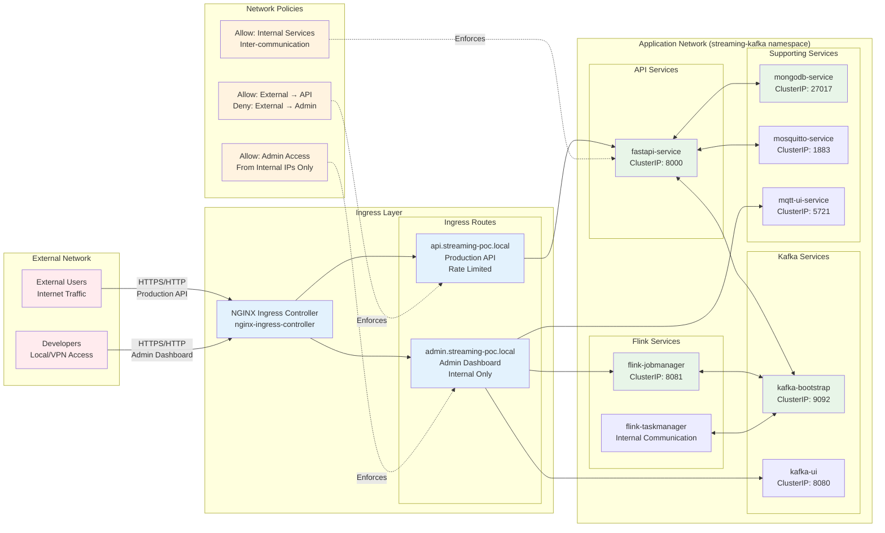
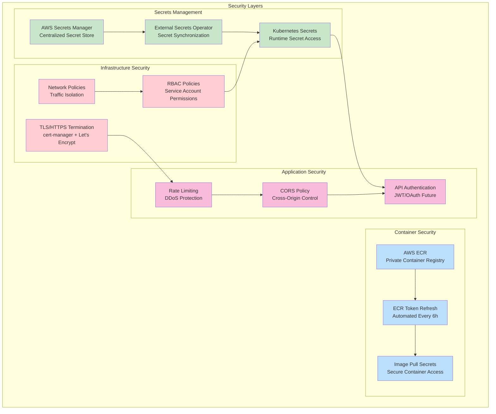
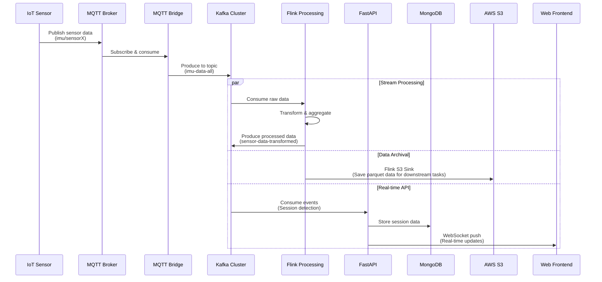

# System Architecture

## Complete System Design

```mermaid
graph TB
    %% External Data Sources
    subgraph "Data Sources"
        S1[IoT Sensor 1<br/>Client ID: sensor1]
        S2[IoT Sensor 2<br/>Client ID: sensor2]
        S3[IoT Sensor 3<br/>Client ID: sensor3]
        SIM[Sensor Simulator<br/>Python Script]
    end

    %% Ingress Layer
    subgraph "Ingress Layer"
        MQTT[MQTT Broker<br/>Eclipse Mosquitto<br/>Port: 1883/8883]
        LB[Load Balancer<br/>NGINX Ingress]
    end

    %% Message Processing Layer
    subgraph "Message Processing"
        MB[MQTT Bridge<br/>Go Service<br/>mqtt-bridge]
        KC[Kafka Connect<br/>MQTT Source Connector]
    end

    %% Event Streaming Platform
    subgraph "Kafka Cluster (Strimzi)"
        KB1[Kafka Broker 1]
        KB2[Kafka Broker 2] 
        KB3[Kafka Broker 3]
        
        subgraph "Topics"
            T1[imu-data-all<br/>Partitions: 10<br/>Replication: 3]
            T2[sensor-data-aggregated<br/>Partitions: 10]
            T3[sensor-data-transformed<br/>Partitions: 10]
            T4[new-session-topic<br/>Session Events]
        end
    end

    %% Stream Processing Layer
    subgraph "Stream Processing (Apache Flink)"
        FJM[Flink JobManager<br/>Coordination & Scheduling]
        FTM1[Flink TaskManager 1<br/>32GB Memory<br/>10 Task Slots]
        FTM2[Flink TaskManager 2<br/>32GB Memory<br/>10 Task Slots]
        FTM3[Flink TaskManager 3<br/>32GB Memory<br/>10 Task Slots]
        
        subgraph "Flink Jobs"
            FJ1[Sensor Data Processing Job<br/>Real-time Transformation]
            FJ2[Session Aggregation Job<br/>Windowed Processing]
            FJ3[ML Inference Job<br/>ONNX Model Processing]
        end
    end

    %% Application Layer
    subgraph "Application Services"
        API[FastAPI Application<br/>REST API & WebSocket<br/>Port: 8000]
        WS[WebSocket Handler<br/>Real-time Data Streaming]
        CONSUMER[Kafka Consumer<br/>Session Event Processing]
    end

    %% Data Storage Layer
    subgraph "Data Storage"
        MONGO[MongoDB<br/>Session & Processed Data<br/>streaming_poc DB]
        S3[AWS S3 Bucket<br/>Raw & Processed Data<br/>Parquet Format]
        S3_ML[S3 ML Models<br/>ONNX Models<br/>Scaling Parameters]
    end

    %% Frontend Layer
    subgraph "Frontend Applications"
        WEB[Web Dashboard<br/>HTML/CSS/JavaScript<br/>Real-time Monitoring]
        MOBILE[Mobile Apps<br/>iOS/Android<br/>Via WebSocket API]
    end

    %% Monitoring & Management
    subgraph "Monitoring & Management"
        KUI[Kafka UI<br/>Topic Management<br/>Port: 8080]
        FUI[Flink Dashboard<br/>Job Monitoring<br/>Port: 8081]
        MQTTUI[MQTT UI<br/>Message Monitoring<br/>Port: 5721]
        PROM[Prometheus<br/>Metrics Collection]
        GRAF[Grafana<br/>Monitoring Dashboard]
    end

    %% External Services
    subgraph "External Services"
        ESO[External Secrets Operator<br/>AWS Secrets Manager]
        CM[cert-manager<br/>TLS Certificate Management]
        ECR[AWS ECR<br/>Container Registry]
        SM[AWS Secrets Manager<br/>Configuration Storage]
    end

    %% Data Flow Connections
    S1 -->|MQTT Publish<br/>imu/sensor1| MQTT
    S2 -->|MQTT Publish<br/>imu/sensor2| MQTT
    S3 -->|MQTT Publish<br/>imu/sensor3| MQTT
    SIM -->|Test Data<br/>All Sensors| MQTT

    MQTT -->|Subscribe &<br/>Forward| MB
    MB -->|Produce<br/>Messages| T1
    
    T1 --> KB1
    T1 --> KB2  
    T1 --> KB3

    %% Flink Processing
    KB1 --> FJ1
    KB2 --> FJ1
    KB3 --> FJ1
    FJ1 --> T2
    FJ1 --> T3
    
    T2 --> FJ2
    FJ2 --> T4
    
    T3 --> FJ3
    S3_ML -->|Load Models| FJ3

    %% Application Processing
    T4 --> CONSUMER
    T1 --> API
    T2 --> API
    T3 --> API
    
    CONSUMER --> MONGO
    API --> WS
    API --> MONGO

    %% Data Persistence
    T1 -->|Kafka Connect<br/>S3 Sink| S3
    T2 --> S3
    T3 --> S3
    FJ3 --> S3

    %% Frontend Connections
    WS -.->|WebSocket<br/>Real-time Data| WEB
    WS -.->|WebSocket<br/>Real-time Data| MOBILE
    API <-->|REST API<br/>HTTP/HTTPS| WEB
    API <-->|REST API<br/>HTTP/HTTPS| MOBILE

    %% Ingress & Access
    LB --> API
    LB --> KUI
    LB --> FUI
    LB --> MQTTUI

    %% External Service Connections
    ESO -->|Sync Secrets| API
    ESO -->|Sync Secrets| MB
    ESO -->|Sync Secrets| FJ1
    ESO -->|Sync Secrets| FJ3
    
    SM -->|Source Secrets| ESO
    ECR -->|Pull Images| API
    ECR -->|Pull Images| MB
    ECR -->|Pull Images| FJM
    
    CM -->|TLS Certificates| LB

    %% Monitoring Connections  
    API --> PROM
    MB --> PROM
    FJM --> PROM
    KB1 --> PROM
    PROM --> GRAF

    %% Styling
    classDef dataSource fill:#e1f5fe
    classDef ingress fill:#f3e5f5
    classDef processing fill:#e8f5e8
    classDef storage fill:#fff3e0
    classDef frontend fill:#fce4ec
    classDef monitoring fill:#f1f8e9
    classDef external fill:#efebe9

    class S1,S2,S3,SIM dataSource
    class MQTT,LB ingress
    class MB,KC,FJM,FTM1,FTM2,FTM3,FJ1,FJ2,FJ3,API processing
    class MONGO,S3,S3_ML storage
    class WEB,MOBILE frontend
    class KUI,FUI,MQTTUI,PROM,GRAF monitoring
    class ESO,CM,ECR,SM external
```

## Network Architecture

```mermaid
graph LR
    %% External Traffic
    subgraph "External Network"
        EXT[External Users<br/>Internet Traffic]
        DEV[Developers<br/>Local/VPN Access]
    end

    %% Ingress Layer
    subgraph "Ingress Layer"
        LB[NGINX Ingress Controller<br/>nginx-ingress-controller]
        
        subgraph "Ingress Routes"
            API_ROUTE[api.streaming-poc.local<br/>Production API<br/>Rate Limited]
            ADMIN_ROUTE[admin.streaming-poc.local<br/>Admin Dashboard<br/>Internal Only]
        end
    end

    %% Application Network
    subgraph "Application Network (streaming-kafka namespace)"
        subgraph "API Services"
            API_SVC[fastapi-service<br/>ClusterIP: 8000]
        end
        
        subgraph "Kafka Services"
            KAFKA_SVC[kafka-bootstrap<br/>ClusterIP: 9092]
            KAFKA_UI_SVC[kafka-ui<br/>ClusterIP: 8080]
        end
        
        subgraph "Flink Services"
            FLINK_JM_SVC[flink-jobmanager<br/>ClusterIP: 8081]
            FLINK_TM_SVC[flink-taskmanager<br/>Internal Communication]
        end
        
        subgraph "Supporting Services"
            MONGO_SVC[mongodb-service<br/>ClusterIP: 27017]
            MQTT_SVC[mosquitto-service<br/>ClusterIP: 1883]
            MQTT_UI_SVC[mqtt-ui-service<br/>ClusterIP: 5721]
        end
    end

    %% Network Policies
    subgraph "Network Policies"
        NP1[Allow: External → API<br/>Deny: External → Admin]
        NP2[Allow: Internal Services<br/>Inter-communication]
        NP3[Allow: Admin Access<br/>From Internal IPs Only]
    end

    %% External Connections
    EXT -->|HTTPS/HTTP<br/>Production API| LB
    DEV -->|HTTPS/HTTP<br/>Admin Dashboard| LB
    
    %% Ingress Routing
    LB --> API_ROUTE
    LB --> ADMIN_ROUTE
    
    API_ROUTE --> API_SVC
    ADMIN_ROUTE --> KAFKA_UI_SVC
    ADMIN_ROUTE --> FLINK_JM_SVC
    ADMIN_ROUTE --> MQTT_UI_SVC
    
    %% Internal Service Communication
    API_SVC <--> KAFKA_SVC
    API_SVC <--> MONGO_SVC
    FLINK_JM_SVC <--> KAFKA_SVC
    FLINK_TM_SVC <--> KAFKA_SVC
    API_SVC <--> MQTT_SVC

    %% Network Policy Enforcement
    NP1 -.->|Enforces| API_ROUTE
    NP2 -.->|Enforces| API_SVC
    NP3 -.->|Enforces| ADMIN_ROUTE

    %% Styling
    classDef external fill:#ffebee
    classDef ingress fill:#e3f2fd
    classDef application fill:#e8f5e8
    classDef security fill:#fff3e0
    
    class EXT,DEV external
    class LB,API_ROUTE,ADMIN_ROUTE ingress
    class API_SVC,KAFKA_SVC,FLINK_JM_SVC,MONGO_SVC application
    class NP1,NP2,NP3 security
```

## Security Architecture

```mermaid
graph TD
    subgraph "Security Layers"
        subgraph "Infrastructure Security"
            TLS[TLS/HTTPS Termination<br/>cert-manager + Let's Encrypt]
            NP[Network Policies<br/>Traffic Isolation]
            RBAC[RBAC Policies<br/>Service Account Permissions]
        end
        
        subgraph "Secrets Management"
            ESO[External Secrets Operator<br/>Secret Synchronization]
            SM[AWS Secrets Manager<br/>Centralized Secret Store]
            K8S_SEC[Kubernetes Secrets<br/>Runtime Secret Access]
        end
        
        subgraph "Container Security"
            ECR[AWS ECR<br/>Private Container Registry]
            ECR_TOKEN[ECR Token Refresh<br/>Automated Every 6h]
            IMG_PULL[Image Pull Secrets<br/>Secure Container Access]
        end
        
        subgraph "Application Security"
            API_AUTH[API Authentication<br/>JWT/OAuth Future]
            CORS[CORS Policy<br/>Cross-Origin Control]
            RATE_LIMIT[Rate Limiting<br/>DDoS Protection]
        end
    end

    %% Security Flow
    SM --> ESO
    ESO --> K8S_SEC
    K8S_SEC --> API_AUTH
    
    ECR --> ECR_TOKEN
    ECR_TOKEN --> IMG_PULL
    
    TLS --> RATE_LIMIT
    RATE_LIMIT --> CORS
    CORS --> API_AUTH
    
    NP --> RBAC
    RBAC --> K8S_SEC

    %% Styling
    classDef security fill:#ffcdd2
    classDef secrets fill:#c8e6c9
    classDef container fill:#bbdefb
    classDef application fill:#f8bbd9
    
    class TLS,NP,RBAC security
    class ESO,SM,K8S_SEC secrets
    class ECR,ECR_TOKEN,IMG_PULL container
    class API_AUTH,CORS,RATE_LIMIT application
```

## Data Flow Architecture

```mermaid
sequenceDiagram
    participant Sensor as IoT Sensor
    participant MQTT as MQTT Broker
    participant Bridge as MQTT Bridge
    participant Kafka as Kafka Cluster
    participant Flink as Flink Processing
    participant API as FastAPI
    participant Mongo as MongoDB
    participant S3 as AWS S3
    participant Frontend as Web Frontend

    %% Real-time Data Flow
    Sensor->>MQTT: Publish sensor data<br/>(imu/sensorX)
    MQTT->>Bridge: Subscribe & consume
    Bridge->>Kafka: Produce to topic<br/>(imu-data-all)
    
    %% Parallel Processing Paths
    par Stream Processing
        Kafka->>Flink: Consume raw data
        Flink->>Flink: Transform & aggregate
        Flink->>Kafka: Produce processed data<br/>(sensor-data-transformed)
    and Data Archival
        Flink->>S3: Flink S3 Sink<br/>(Save parquet data for downstream tasks)
    and Real-time API
        Kafka->>API: Consume events<br/>(Session detection)
        API->>Mongo: Store session data
        API->>Frontend: WebSocket push<br/>(Real-time updates)
    end
    
```

## Deployment Architecture

```mermaid
graph TB
    subgraph "Kubernetes Cluster"
        subgraph "Operators"
            STRIMZI[Strimzi Kafka Operator<br/>Kafka Cluster Management]
            FLINK_OP[Flink Kubernetes Operator<br/>Flink Job Management]
            ESO_OP[External Secrets Operator<br/>Secret Synchronization]
            CM_OP[cert-manager<br/>Certificate Management]
        end
        
        subgraph "Application Deployments"
            API_DEP[FastAPI Deployment<br/>Replicas: 2<br/>Resources: 2CPU, 4GB]
            BRIDGE_DEP[MQTT Bridge Deployment<br/>Replicas: 1<br/>Resources: 1CPU, 2GB]
            FLINK_JM_DEP[Flink JobManager<br/>Replicas: 1<br/>Resources: 2CPU, 4GB]
            FLINK_TM_DEP[Flink TaskManager<br/>Replicas: 3<br/>Resources: 10 slots, 10CPU, 32GB]
        end
        
        subgraph "Managed Services"
            KAFKA_CLUSTER[Kafka Cluster<br/>Brokers: 3<br/>10 topics]
            MONGO_DEP[MongoDB<br/>Replicas: 1<br/>]
            MQTT_DEP[Mosquitto MQTT<br/>Replicas: 1]
        end
        
        subgraph "Monitoring"
            KAFKA_UI_DEP[Kafka UI<br/>Web Interface]
            FLINK_UI[Flink Dashboard<br/>Built-in UI]
            MQTT_UI_DEP[MQTT UI<br/>Web Interface]
        end
    end
    
    subgraph "External Dependencies"
        AWS_ECR[AWS ECR<br/>Container Images]
        AWS_SM[AWS Secrets Manager<br/>Configuration]
        AWS_S3[AWS S3<br/>Data Storage]
        LETS_ENCRYPT[Let's Encrypt<br/>TLS Certificates]
    end
    
    %% Dependencies
    ESO_OP --> AWS_SM
    CM_OP --> LETS_ENCRYPT
    API_DEP --> AWS_ECR
    BRIDGE_DEP --> AWS_ECR
    FLINK_JM_DEP --> AWS_ECR
    FLINK_TM_DEP --> AWS_S3
    
    %% Inter-service Dependencies
    API_DEP --> KAFKA_CLUSTER
    API_DEP --> MONGO_DEP
    BRIDGE_DEP --> KAFKA_CLUSTER
    BRIDGE_DEP --> MQTT_DEP
    FLINK_JM_DEP --> KAFKA_CLUSTER
    FLINK_TM_DEP --> KAFKA_CLUSTER

    %% Styling
    classDef operator fill:#e1f5fe
    classDef application fill:#e8f5e8
    classDef storage fill:#fff3e0
    classDef monitoring fill:#f3e5f5
    classDef external fill:#efebe9
    
    class STRIMZI,FLINK_OP,ESO_OP,CM_OP operator
    class API_DEP,BRIDGE_DEP,FLINK_JM_DEP,FLINK_TM_DEP application
    class KAFKA_CLUSTER,MONGO_DEP,MQTT_DEP storage
    class KAFKA_UI_DEP,FLINK_UI,MQTT_UI_DEP monitoring
    class AWS_ECR,AWS_SM,AWS_S3,LETS_ENCRYPT external
```
